# H13ris Desktop Pets — Hybris & Iblis

<p align="center">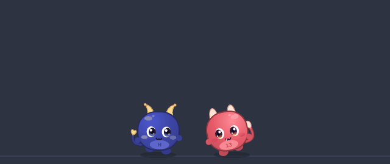</p>

**English** · Two tiny demons that live on your Windows desktop, across all your monitors.
They chat, race, fight with pillows, open treasure chests and fly; run the script twice
and the first pair hunts the intruders. On the main screen they raise a family: eggs,
school and homework on your real clock, mischief and scolding, courtship, weddings under
a flower arch, grandchildren, old age and a farewell to the moon — everything saved
between sessions, with a demo mode that plays a whole life in eight minutes.
One Python file (PyQt6), vector-drawn, no network, no open port, MIT.

```bat
pip install PyQt6
pythonw h13ris_pets.py
```

Prefer a single `.exe`? Grab it from the [Releases](https://github.com/hi3ris/H13ris-Desktop-Pets/releases)
page (Windows may show a SmartScreen warning for unsigned apps: *More info → Run anyway*).
Right-click a demon for the menu. The documentation below is in French.

---

Deux petits démons tout ronds qui vivent sur ton bureau Windows, sur tous tes écrans.
Un seul fichier Python, zéro réseau, zéro port ouvert.

## Installation

```bat
pip install PyQt6
pythonw h13ris_pets.py
```

Ou l'exécutable `H13risDesktopPets.exe` des [Releases](https://github.com/hi3ris/H13ris-Desktop-Pets/releases),
sans rien installer (Windows peut afficher un avertissement SmartScreen : *Informations
complémentaires → Exécuter quand même*).

`activer_demarrage.bat` active le lancement automatique au démarrage de Windows
(décochable dans le menu, ou `python h13ris_pets.py --autostart off`).

Clic droit sur un démon (ou sur l'icône près de l'horloge) ouvre le menu.

## Le duo

Hybris (bleu) et Iblis (rouge) marchent, dorment, discutent, se chamaillent,
font la course, se portent, dansent, prennent des photos et se livrent des
batailles de polochons — selon leur énergie, leur ennui et leur complicité.
Ils passent d'un écran à l'autre : chute vers un écran plus bas, saut vers un
écran plus haut, tunnel vers un écran inaccessible à pied.

<p align="center">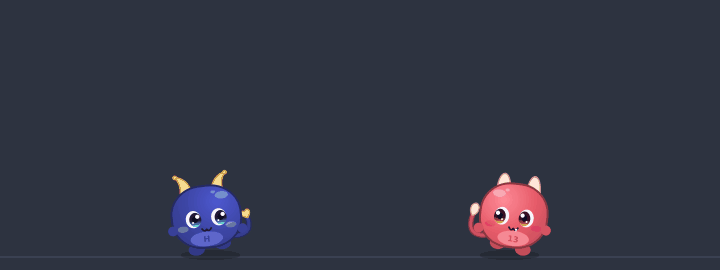</p>

## Coffres, objets et vol

Des coffres apparaissent sur les écrans : blaster Nerf, marteau-jouet,
BlueShield, potions (sang, vitesse, invisibilité, vol), trottinette, peau de
banane, fumigène, jetpack, ballon, fusée.

<p align="center">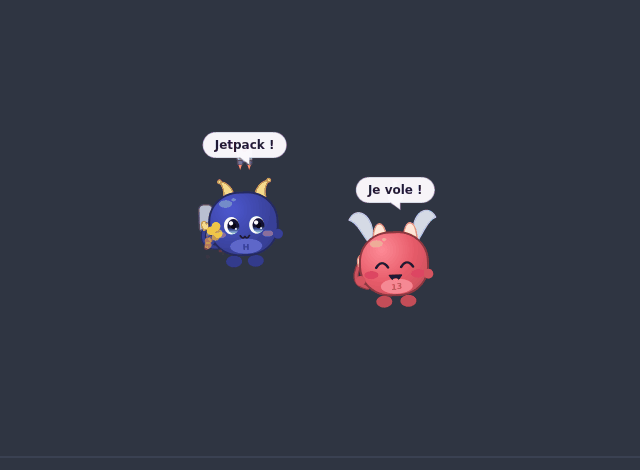</p>

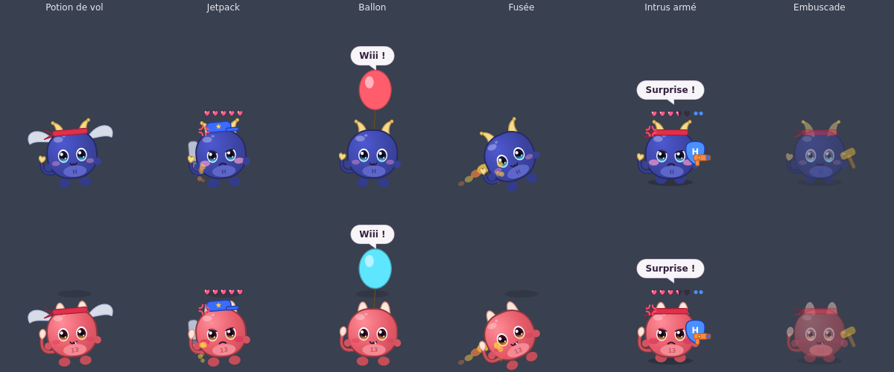

## Mode chasse

Lance le script une deuxième fois : la première instance devient *la Garde* et
traque les intrus ; chaque instance suivante est un duo d'intrus qui fuit, se
camoufle, creuse, s'envole ou tient tête quand il est armé. Les instances se
parlent par de petits fichiers JSON dans le dossier temporaire — pas de réseau.

<p align="center">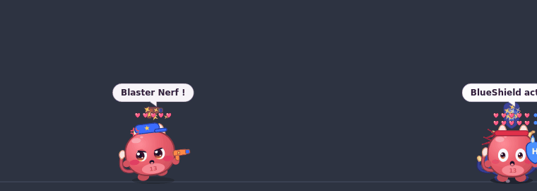</p>

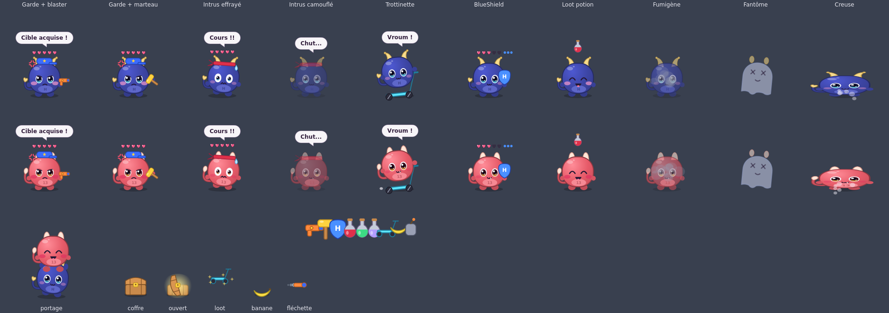

## Vie de famille et de communauté

Sur l'écran principal : une maison, un bureau, une école. Quand la complicité
est haute, un œuf éclot. Chaque habitant a une couleur héritée, deux traits de
caractère, des besoins et des relations. La journée suit la vraie horloge :
école en semaine, devoirs à 15h30 (les parents aident, la note monte de F à A),
repas, travail des adultes, coucher échelonné. Les enfants jouent, se
chamaillent, font des bêtises et se font gronder. Les adultes se font la cour,
se marient sous l'arche fleurie, ont des enfants ; des visiteurs du village
arrivent avec leur valise. Les âges se comptent en heures d'activité :
bébé → enfant → ado → adulte → aîné, puis départ « vers la lune », tombe fleurie
et deuil. Tout est sauvegardé ; le livre de famille (HTML) raconte la
chronique, l'arbre et le mémorial.

| École et devoirs | Bêtise et gronderie |
| :---: | :---: |
| 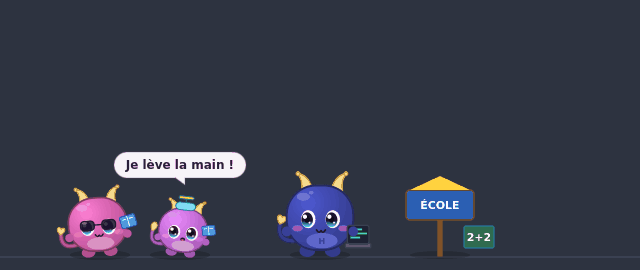 | 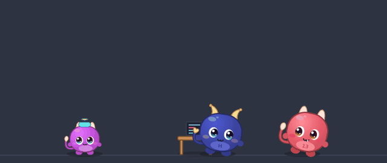 |
| **Anniversaire** | **Mariage** |
| 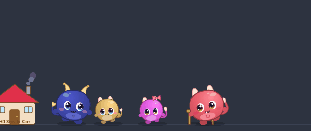 | 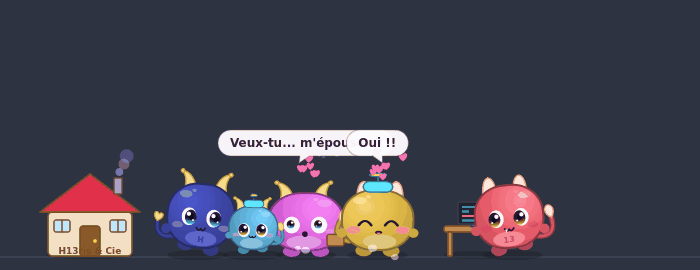 |

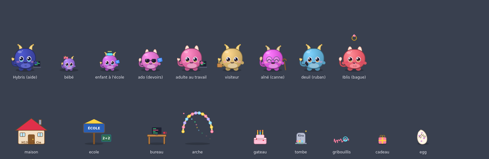

**Mode démo** : une vie entière du village en huit minutes, sans toucher à la
vraie famille.

## Menu et réglages

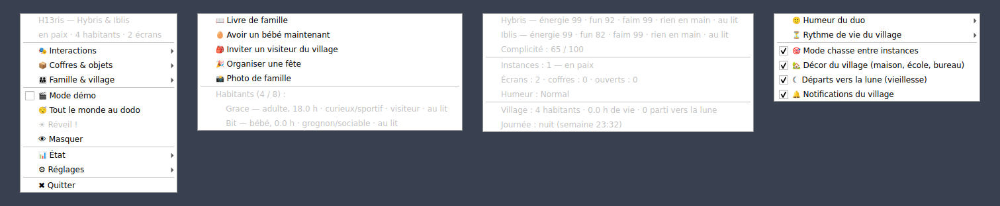

Humeur du duo (calme / normal / chaotique), rythme de vie du village (court /
normal / long), mode chasse, décor, départs vers la lune, notifications,
démarrage automatique. Les démons se cachent tout seuls quand une application
passe en plein écran et ne volent jamais le focus.

## Tests

Simulations accélérées, sans affichage (`QT_QPA_PLATFORM=offscreen`) :

```bash
python tests/test_life.py      # cycle de vie complet : école, devoirs, bêtises, mariage, départ
python tests/test_natural.py   # une journée réelle du village
python tests/test_demo.py      # mode démo de bout en bout
python tests/test_v3.py        # duos, coffres, chasse entre trois instances
python tests/test_v4.py        # vol et intrus armés
python tests/render_life.py    # régénère docs/apercu_vie.png
python tests/make_gifs.py      # régénère les GIF de docs/
```

## Structure

- `h13ris_pets.py` — tout le programme (PyQt6, dessin vectoriel, aucune ressource externe)
- `docs/` — aperçus, GIF, icône et les deux notes de recherche qui ont guidé le design
  (mascottes mignonnes, vie de famille simulée)
- `tests/` — simulations et générateurs d'aperçus
- `.github/workflows/build-exe.yml` — compile le `.exe` (PyInstaller) à chaque release

Licence MIT.
